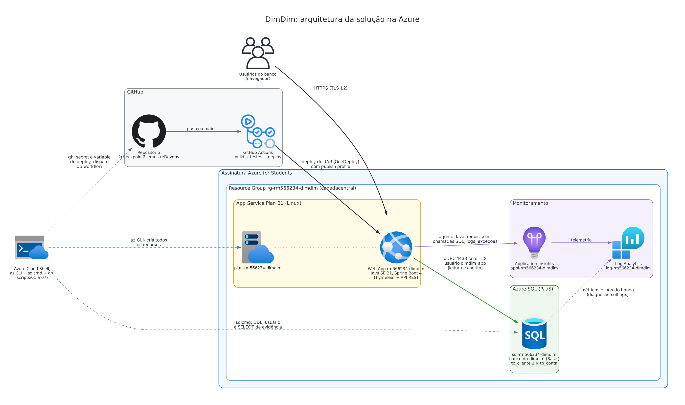

# DimDim - Web App bancária na Azure 💰

O **DimDim** é o banco digital do estudo de caso da disciplina, e esta aplicação web, escrita em **Java 21 + Spring Boot 4**, é o seu sistema de cadastro, no qual o operador do banco cadastra clientes e abre, altera e encerra as contas de cada um.

Este repositório contém a entrega do **2º Checkpoint do 2º semestre de DevOps Tools & Cloud Computing (Aplicações e Banco em Nuvem)**. A aplicação roda no **Azure App Service** (PaaS, Linux, Java SE 21), grava os dados no **Azure SQL Database** (PaaS, sem nenhum container), é monitorada pelo **Application Insights** e chega à nuvem por um deploy automatizado com **Azure CLI e GitHub Actions**.

---

## 👥 Equipe

| RM | Nome Completo | Turma |
|:---:|:---|:---:|
| RM561489 | Ana Flávia Camelo | 2TDSPV |
| RM562745 | Gustavo Kenji Terada | 2TDSPV |
| RM566234 | João Guilherme Carvalho Novaes | 2TDSPV |
| RM565154 | Pedro Chasci Puga | 2TDSPV |
| RM561342 | Lucas Figueiredo Vieira | 2TDSPV |

- **Repositório GitHub**: https://github.com/Doublekill0909/2checkpoint2semestreDevops
- **Vídeo no YouTube**: _link incluído após a gravação_
- **Aplicação na nuvem**: https://rm566234-dimdim.azurewebsites.net

---

## 📝 Descrição da Solução

O DimDim precisa de um lugar único para manter o cadastro de quem é cliente do banco e das contas que cada cliente possui. A aplicação resolve isso com duas tabelas relacionadas, ambas com CRUD completo: `tb_cliente` guarda os clientes e `tb_conta` guarda as contas, e cada conta aponta para o seu titular por uma chave estrangeira, de modo que um cliente pode ter várias contas e toda conta pertence a exatamente um cliente.

O operador usa um **front end web em Thymeleaf**, renderizado pelo próprio Spring Boot, com estas telas:

- O painel inicial resume, numa frase, quanto dinheiro o banco guarda nas contas ativas e lista as últimas contas abertas.
- A tela de clientes lista, cadastra, edita e exclui clientes, e a ficha de cada cliente mostra os dados dele e as contas de que é titular.
- A tela de contas lista todas as contas com o titular de cada uma, abre novas contas e edita ou exclui as existentes.

As mesmas operações também existem como **API REST** (`/api/clientes` e `/api/contas`), que usa exatamente as mesmas regras de negócio das telas. A entrega principal é o front end; a API complementa a solução para testes automatizados e integrações, e os JSONs das operações GET, POST, PUT e DELETE estão na seção [API REST](#-api-rest-json-das-operações).

A aplicação segue estas regras de negócio:

1. CPF e e-mail são únicos. O CPF pode ser digitado com ou sem pontuação, porque o sistema guarda só os 11 dígitos, e o e-mail é gravado em minúsculas.
2. O número da conta é gerado pelo sistema no formato `00000-0`, com dígito verificador módulo 11, e a agência é sempre `0001`, já que o DimDim é um banco digital de agência única.
3. O titular de uma conta não muda depois da abertura.
4. Um cliente que ainda é titular de alguma conta não pode ser excluído. A chave estrangeira já impediria a exclusão no banco, e a aplicação verifica antes para mostrar uma mensagem clara.
5. O saldo nunca é negativo, e uma conta inativa continua cadastrada, mas fica fora do saldo total do painel.

---

## 🚀 Benefícios para o Negócio

1. O cadastro é confiável, porque as restrições do banco (chaves, unicidade e CHECK) e a validação da aplicação impedem CPF duplicado, conta sem titular e saldo negativo.
2. O banco não precisa administrar servidores, já que App Service e Azure SQL são serviços PaaS e a Azure cuida de sistema operacional, patches, backup e disponibilidade.
3. Cada push na `main` compila, testa e publica a aplicação sozinho, o que reduz o tempo entre uma correção e a sua chegada aos usuários.
4. O Application Insights mostra cada requisição e cada comando SQL que ela gerou, o que encurta a investigação de lentidão e de erros.
5. O custo fica sob controle, porque os tiers B1 (App Service) e Basic (Azure SQL) são cobrados por hora e todos os recursos ficam num único Resource Group, apagado por um script.

---

## 🏗️ Arquitetura da Solução (Nuvem)



Todos os recursos da Azure ficam no Resource Group `rg-rm566234-dimdim` e são criados pelos scripts de Azure CLI da pasta `scripts`, executados no Azure Cloud Shell. A arquitetura tem quatro fluxos:

1. No provisionamento, os scripts `01` a `04`, executados no Cloud Shell, criam o Resource Group, o servidor e o banco Azure SQL (com o DDL e o usuário da aplicação), o Application Insights com o seu Log Analytics workspace e, por fim, o plano do App Service e a Web App.
2. No deploy, um push na `main` ou o disparo feito pelo script `05` aciona o workflow do GitHub Actions, que compila o projeto, roda os testes e publica o JAR na Web App por OneDeploy, autenticado pelo publish profile guardado como secret do repositório.
3. No uso, o navegador acessa a Web App por HTTPS, e a aplicação consulta e grava no Azure SQL Database por JDBC criptografado com TLS, conectada com um usuário que só lê e grava dados.
4. No monitoramento, a instrumentação automática do App Service injeta o agente Java do Application Insights, que registra requisições, chamadas SQL, logs e exceções. O Azure SQL e a Web App também mandam métricas e logs de plataforma ao mesmo Log Analytics workspace, por diagnostic settings.

| Recurso | Nome | Configuração |
|---|---|---|
| Resource Group | `rg-rm566234-dimdim` | região `canadacentral` |
| Plano do App Service | `plan-rm566234-dimdim` | Linux, B1 |
| Web App | `rm566234-dimdim` | Java SE 21, HTTPS obrigatório, TLS 1.2, Always On, FTP desligado |
| Servidor Azure SQL | `sql-rm566234-dimdim` | TLS 1.2 mínimo, firewall com o App Service e o Cloud Shell |
| Banco Azure SQL | `db-dimdim` | Basic (5 DTUs, 2 GB), backup LRS |
| Application Insights | `appi-rm566234-dimdim` | baseado em workspace |
| Log Analytics workspace | `log-rm566234-dimdim` | retenção de 30 dias |

O desenho é gerado a partir de código por [`docs/arquitetura.py`](./docs/arquitetura.py), com os ícones oficiais da Azure.

---

## 🗄️ Banco de Dados

O DDL das tabelas está em [`scripts/script_bd.sql`](./scripts/script_bd.sql). Ele é a fonte da verdade do schema, porque a aplicação não cria tabelas: ela sobe com `spring.jpa.hibernate.ddl-auto=validate` e o Hibernate recusa iniciar se o banco divergir das entidades. O teste `ScriptBdTest` confere esse alinhamento a cada build, antes do deploy.

| Tabela | Colunas | Restrições |
|---|---|---|
| `tb_cliente` | `id`, `nome`, `cpf`, `email`, `telefone`, `data_nascimento`, `data_cadastro` | PK `id` (IDENTITY), `cpf` e `email` únicos, CPF só com 11 dígitos |
| `tb_conta` | `id`, `cliente_id`, `agencia`, `numero`, `tipo`, `saldo`, `ativa`, `data_abertura` | PK `id`, FK `cliente_id` → `tb_cliente.id`, agência + número únicos, tipo em (`CORRENTE`, `POUPANCA`, `SALARIO`), saldo ≥ 0 |

Todas as tabelas e colunas têm comentário (`MS_Description`), a FK tem índice, e os valores padrão de data usam o horário de Brasília, o mesmo fuso com que a aplicação grava. O script é idempotente e roda numa única transação, portanto executá-lo de novo não apaga dados e uma falha no meio desfaz tudo.

A aplicação não se conecta com o administrador do servidor. O script [`scripts/script_usuario_app.sql`](./scripts/script_usuario_app.sql) cria um **usuário contido** no banco, com os papéis `db_datareader` e `db_datawriter`, o que significa que ele lê e grava dados, mas não consegue criar, alterar ou apagar tabelas. O administrador fica restrito aos scripts de provisionamento.

---

## 💻 How-to: Deploy Completo (Passo a Passo)

### Pré-requisitos

- É preciso ter uma subscription ativa na Azure (Azure for Students ou similar).
- É preciso ter uma conta no GitHub com permissão de escrita neste repositório, ou num fork dele.
- Todos os comandos rodam no **Azure Cloud Shell (Bash)**, que já traz o Azure CLI autenticado, o `sqlcmd`, o GitHub CLI (`gh`) e o `git`, de modo que basta um navegador e nada precisa ser instalado na máquina local.

### 1. Abra o Azure Cloud Shell

No [portal da Azure](https://portal.azure.com), clique no ícone `>_` da barra superior e escolha **Bash**. Se a sessão ainda não tiver subscription selecionada, rode `az account set --subscription "<nome da subscription>"`.

### 2. Clone o repositório

```bash
git clone https://github.com/Doublekill0909/2checkpoint2semestreDevops.git
cd 2checkpoint2semestreDevops
```

### 3. Configure as credenciais

```bash
cp .env.example .env
nano .env
```

O `.env` guarda os usuários e as senhas do banco e nunca vai para o Git, porque está no `.gitignore`. Preencha as quatro variáveis:

| Variável | Uso |
|---|---|
| `SQL_ADMIN_USER` / `SQL_ADMIN_PASSWORD` | Administrador do servidor Azure SQL, usado apenas pelos scripts. |
| `APP_DB_USER` / `APP_DB_PASSWORD` | Usuário da aplicação, com que a Web App se conecta ao banco. |

As senhas precisam seguir a política do Azure SQL: de 8 a 128 caracteres, com pelo menos três destes quatro grupos (maiúsculas, minúsculas, números e símbolos) e sem conter o nome do usuário. O `scripts/00-vars.sh` confere isso antes de criar qualquer recurso.

### 4. Crie os recursos na Azure

Execute os scripts na ordem. Cada um mostra o que criou e qual é o próximo passo.

```bash
# 1. Confere login, regiões permitidas e provedores; cria o Resource Group
bash scripts/01-resource-group.sh

# 2. Servidor + banco Azure SQL, firewall, DDL das tabelas e usuário da aplicação
bash scripts/02-sql.sh

# 3. Log Analytics workspace + Application Insights + diagnóstico do banco
bash scripts/03-monitoramento.sh

# 4. Plano do App Service + Web App Java 21 + app settings + logs
bash scripts/04-webapp.sh
```

Subscriptions Azure for Students só aceitam algumas regiões, e a lista muda de aluno para aluno. O script `01` lê essa política e, se `canadacentral` não estiver permitida, mostra as regiões aceitas. Nesse caso, exporte a região escolhida antes de rodar os scripts:

```bash
export LOCATION=eastus2
```

### 5. Faça o deploy com o GitHub Actions

```bash
bash scripts/05-github-actions.sh
```

O script autentica o GitHub CLI, caso ainda não esteja autenticado (ele mostra um código para colar em https://github.com/login/device), e grava no repositório o secret `AZURE_WEBAPP_PUBLISH_PROFILE` e a variable `AZURE_WEBAPP_NAME`. Em seguida, dispara o workflow [`deploy.yml`](./.github/workflows/deploy.yml), acompanha a execução no terminal e, ao final, confere o `/actuator/health` da aplicação na nuvem.

O workflow tem dois jobs, que também podem ser acompanhados na aba **Actions** do repositório:

1. **Build e testes** compila com Maven, roda a suíte de testes (o resumo aparece na página da execução) e guarda o `dimdim.jar` como artefato.
2. **Deploy no Azure App Service** publica o JAR na Web App por OneDeploy e só termina com sucesso quando `/actuator/health` responde `UP`, o que confirma que a aplicação subiu e alcançou o banco.

A partir daqui, todo push na `main` repete build, testes e deploy sem nenhum comando manual.

### 6. Confira o que foi criado

```bash
bash scripts/06-status.sh
```

O script lista os recursos do Resource Group, a Web App, o Azure SQL, o monitoramento e as últimas execuções do pipeline, sem exibir nenhum segredo (das app settings aparecem só os nomes).

### 7. Teste o CRUD e confira cada operação no banco

Acesse **https://rm566234-dimdim.azurewebsites.net**. O rodapé de cada página informa o host e a região do App Service que a gerou. Depois de cada operação, rode no Cloud Shell:

```bash
bash scripts/07-consultar-banco.sh
```

Esse script executa [`scripts/consultas_crud.sql`](./scripts/consultas_crud.sql) no Azure SQL com o usuário da aplicação e mostra `tb_cliente`, `tb_conta` (com o nome do titular, obtido pela FK) e os totais. Como alternativa, o mesmo arquivo pode ser colado no **Query editor** do banco, no portal da Azure.

Siga esta sequência, que exercita as quatro operações nas duas tabelas:

1. Rode `07-consultar-banco.sh` antes de qualquer operação, para mostrar as tabelas vazias.
2. Cadastre um cliente em **Clientes → Cadastrar cliente** e rode a consulta, que passa a mostrar a linha em `tb_cliente` com `data_cadastro` no horário de Brasília. Cadastre um segundo cliente da mesma forma.
3. Na ficha do cliente, clique em **Editar**, mude o telefone ou o e-mail, salve e rode a consulta para mostrar a alteração.
4. Ainda na ficha, clique em **Abrir conta**, escolha o tipo e o saldo inicial e rode a consulta, em que a conta aparece em `tb_conta` com `cliente_id` apontando para o titular. Abra uma segunda conta.
5. Em **Contas**, clique em **Editar**, mude o tipo e o saldo, desmarque **Conta ativa**, salve e rode a consulta.
6. Tente excluir um cliente que ainda tem contas. A aplicação recusa e explica o motivo, e a consulta mostra que o cliente continua no banco, o que evidencia a integridade referencial entre as tabelas.
7. Em **Contas**, exclua uma conta e rode a consulta.
8. Exclua as contas restantes do cliente, depois o próprio cliente, e rode a consulta.
9. Para encerrar, compare as listas das telas com o resultado da consulta no banco.

### 8. Acompanhe o monitoramento

No portal, abra o Application Insights **appi-rm566234-dimdim**:

- **Live metrics** mostra, em tempo real, as requisições e as chamadas ao banco enquanto as telas são usadas. Abra esta tela antes de executar o passo 7 para ver as operações chegando.
- **Application map** desenha a Web App ligada ao banco `db-dimdim`, com a quantidade de chamadas e o tempo médio de cada lado.
- **Performance**, na aba **Dependencies**, lista os comandos SQL que a aplicação executou em `tb_cliente` e `tb_conta` (INSERT, UPDATE, DELETE e SELECT), com o tempo de cada um.
- **Transaction search** abre uma requisição, como um `POST /clientes`, e mostra a transação de ponta a ponta com o comando SQL que ela executou.
- **Logs** executa as consultas KQL de [`scripts/consultas_monitoramento.kql`](./scripts/consultas_monitoramento.kql). A consulta 3 cruza cada requisição HTTP com os comandos SQL que ela gerou.

Para o lado do banco, abra o banco **db-dimdim → Monitoring → Metrics** e escolha **DTU percentage** e **Successful Connections**. No Log Analytics workspace **log-rm566234-dimdim**, as consultas 6 e 7 do arquivo KQL mostram as métricas do Azure SQL e os logs HTTP do App Service. Fora o Live metrics, a telemetria leva de um a três minutos para aparecer.

### 9. Limpeza (depois do vídeo)

```bash
bash scripts/99-cleanup.sh
```

O script pede o nome do Resource Group como confirmação, apaga todos os recursos e remove do repositório o secret e a variable do deploy, para que os próximos pushes rodem build e testes sem tentar publicar numa Web App que não existe mais.

---

## 🛠️ Artefatos DevOps Entregues

| Artefato | Descrição |
|---|---|
| [`src/`](./src) | Código-fonte da aplicação: entidades JPA, serviços, telas Thymeleaf, API REST e testes. |
| [`pom.xml`](./pom.xml) e [`mvnw`](./mvnw) | Build Maven (Java 21, Spring Boot 4.1) com o Maven Wrapper, sem exigir Maven instalado. |
| [`scripts/script_bd.sql`](./scripts/script_bd.sql) | DDL das tabelas, com restrições, índice e comentários em todas as tabelas e colunas. |
| [`scripts/script_usuario_app.sql`](./scripts/script_usuario_app.sql) | Template do usuário contido da aplicação, com mínimo privilégio. |
| [`scripts/00-vars.sh`](./scripts/00-vars.sh) | Variáveis centralizadas e validação do `.env` (nomes dos recursos, sem segredos). |
| [`scripts/01-resource-group.sh`](./scripts/01-resource-group.sh) | Conferências da subscription e criação do Resource Group. |
| [`scripts/02-sql.sh`](./scripts/02-sql.sh) | Servidor e banco Azure SQL, firewall, execução do DDL e criação do usuário da aplicação. |
| [`scripts/03-monitoramento.sh`](./scripts/03-monitoramento.sh) | Log Analytics workspace, Application Insights e diagnostic settings do banco. |
| [`scripts/04-webapp.sh`](./scripts/04-webapp.sh) | Plano do App Service, Web App Java 21, app settings, logs e credencial de publicação. |
| [`scripts/05-github-actions.sh`](./scripts/05-github-actions.sh) | Secret e variable do repositório, disparo e acompanhamento do deploy. |
| [`scripts/06-status.sh`](./scripts/06-status.sh) | Panorama dos recursos criados e do pipeline. |
| [`scripts/07-consultar-banco.sh`](./scripts/07-consultar-banco.sh) e [`consultas_crud.sql`](./scripts/consultas_crud.sql) | Evidência do CRUD direto no Azure SQL. |
| [`scripts/consultas_monitoramento.kql`](./scripts/consultas_monitoramento.kql) | Consultas KQL do Application Insights e do Log Analytics. |
| [`scripts/99-cleanup.sh`](./scripts/99-cleanup.sh) | Remoção de todos os recursos depois do vídeo. |
| [`.github/workflows/deploy.yml`](./.github/workflows/deploy.yml) | Pipeline de CI/CD: build, testes e deploy no App Service. |
| [`.env.example`](./.env.example) | Modelo de configuração, sem nenhuma credencial real. |
| [`docs/arquitetura.png`](./docs/arquitetura.png) | Desenho da arquitetura, gerado por [`docs/arquitetura.py`](./docs/arquitetura.py). |

---

## ☁️ Comandos do Azure CLI Utilizados

Os scripts automatizam o processo, mas os comandos centrais que eles executam são estes (os valores entre `<>` vêm do `.env` e nunca aparecem no código):

```bash
# Resource Group
az group create --name rg-rm566234-dimdim --location canadacentral

# Azure SQL Database (PaaS)
az sql server create -g rg-rm566234-dimdim -n sql-rm566234-dimdim -l canadacentral \
  --admin-user <SQL_ADMIN_USER> --admin-password <SQL_ADMIN_PASSWORD> --minimal-tls-version 1.2
az sql server firewall-rule create -g rg-rm566234-dimdim -s sql-rm566234-dimdim \
  -n AllowAzureServices --start-ip-address 0.0.0.0 --end-ip-address 0.0.0.0
az sql db create -g rg-rm566234-dimdim -s sql-rm566234-dimdim -n db-dimdim \
  --service-objective Basic --backup-storage-redundancy Local

# Monitoramento
az monitor log-analytics workspace create -g rg-rm566234-dimdim -n log-rm566234-dimdim
az monitor app-insights component create --app appi-rm566234-dimdim -g rg-rm566234-dimdim \
  --kind web --application-type web --workspace <id do workspace>

# App Service (PaaS)
az appservice plan create -g rg-rm566234-dimdim -n plan-rm566234-dimdim --is-linux --sku B1
az webapp create -g rg-rm566234-dimdim -p plan-rm566234-dimdim -n rm566234-dimdim \
  --runtime "JAVA:21-java21" --https-only true --min-tls-version 1.2 --basic-auth Enabled
az webapp config appsettings set -g rg-rm566234-dimdim -n rm566234-dimdim --output none --settings \
  DB_URL=<url jdbc> DB_USER=<APP_DB_USER> DB_PASSWORD=<APP_DB_PASSWORD> \
  APPLICATIONINSIGHTS_CONNECTION_STRING=<connection string> ApplicationInsightsAgent_EXTENSION_VERSION=~3

# GitHub Actions
az webapp deployment list-publishing-profiles -g rg-rm566234-dimdim -n rm566234-dimdim --xml \
  | gh secret set AZURE_WEBAPP_PUBLISH_PROFILE --repo Doublekill0909/2checkpoint2semestreDevops
gh variable set AZURE_WEBAPP_NAME --repo Doublekill0909/2checkpoint2semestreDevops --body rm566234-dimdim
gh workflow run deploy.yml --repo Doublekill0909/2checkpoint2semestreDevops --ref main
```

---

## 🔌 API REST (JSON das operações)

Os exemplos abaixo usam a URL da aplicação na nuvem e foram gerados a partir de respostas reais da aplicação. Em caso de erro, a API responde no formato `application/problem+json` (RFC 9457).

```bash
URL=https://rm566234-dimdim.azurewebsites.net
```

### 👤 Clientes - `/api/clientes`

| Método | Path | Descrição | Sucesso |
|---|---|---|---|
| GET | `/api/clientes` | Lista os clientes, ordenados por nome | 200 |
| GET | `/api/clientes/{id}` | Busca um cliente | 200 |
| POST | `/api/clientes` | Cadastra um cliente | 201 |
| PUT | `/api/clientes/{id}` | Atualiza um cliente | 200 |
| DELETE | `/api/clientes/{id}` | Exclui um cliente sem contas | 204 |

**POST** `/api/clientes`

```bash
curl -i -X POST "$URL/api/clientes" -H "Content-Type: application/json" -d '{
  "nome": "Beatriz Ramos",
  "cpf": "390.533.447-05",
  "email": "Beatriz.Ramos@Exemplo.com",
  "telefone": "(11) 97777-1234",
  "dataNascimento": "1994-08-12"
}'
```

A resposta é `201 Created`, com o cabeçalho `Location` apontando para `/api/clientes/7`. O CPF perde a pontuação e o e-mail é gravado em minúsculas:

```json
{
  "id": 7,
  "nome": "Beatriz Ramos",
  "cpf": "39053344705",
  "email": "beatriz.ramos@exemplo.com",
  "telefone": "(11) 97777-1234",
  "dataNascimento": "1994-08-12",
  "dataCadastro": "2026-10-05T22:07:13",
  "quantidadeContas": 0
}
```

**GET** `/api/clientes/{id}`

```bash
curl -i "$URL/api/clientes/7"
```

A resposta é `200 OK`, com o mesmo formato do POST, e `GET /api/clientes` devolve uma lista de objetos nesse formato.

**PUT** `/api/clientes/{id}`

```bash
curl -i -X PUT "$URL/api/clientes/7" -H "Content-Type: application/json" -d '{
  "nome": "Beatriz Ramos Alves",
  "cpf": "39053344705",
  "email": "beatriz.alves@exemplo.com",
  "telefone": "(11) 97777-1234",
  "dataNascimento": "1994-08-12"
}'
```

A resposta é `200 OK`:

```json
{
  "id": 7,
  "nome": "Beatriz Ramos Alves",
  "cpf": "39053344705",
  "email": "beatriz.alves@exemplo.com",
  "telefone": "(11) 97777-1234",
  "dataNascimento": "1994-08-12",
  "dataCadastro": "2026-10-05T22:07:13",
  "quantidadeContas": 0
}
```

**DELETE** `/api/clientes/{id}`

```bash
curl -i -X DELETE "$URL/api/clientes/7"
```

A resposta é `204 No Content` quando o cliente não tem contas. Se ele ainda for titular de alguma conta, a resposta é `409 Conflict`:

```json
{
  "status": 409,
  "title": "Regra de negócio violada",
  "detail": "O cliente Beatriz Ramos Alves é titular de 1 conta(s). Exclua as contas antes de excluir o cliente.",
  "instance": "/api/clientes/7"
}
```

### 🏦 Contas - `/api/contas`

| Método | Path | Descrição | Sucesso |
|---|---|---|---|
| GET | `/api/contas` | Lista as contas, das mais novas para as mais antigas | 200 |
| GET | `/api/contas?clienteId={id}` | Lista as contas de um titular | 200 |
| GET | `/api/contas/{id}` | Busca uma conta | 200 |
| POST | `/api/contas` | Abre uma conta | 201 |
| PUT | `/api/contas/{id}` | Atualiza tipo, saldo e situação | 200 |
| DELETE | `/api/contas/{id}` | Exclui uma conta | 204 |

**POST** `/api/contas`

```bash
curl -i -X POST "$URL/api/contas" -H "Content-Type: application/json" -d '{
  "clienteId": 7,
  "tipo": "CORRENTE",
  "saldo": 2500.00,
  "ativa": true
}'
```

A resposta é `201 Created`, e a agência, o número e a data de abertura são definidos pelo sistema:

```json
{
  "id": 7,
  "agencia": "0001",
  "numero": "10311-0",
  "tipo": "CORRENTE",
  "saldo": 2500.00,
  "ativa": true,
  "dataAbertura": "2026-10-05",
  "clienteId": 7,
  "clienteNome": "Beatriz Ramos Alves"
}
```

**GET** `/api/contas?clienteId={id}`

```bash
curl -i "$URL/api/contas?clienteId=7"
```

A resposta é `200 OK`, com a lista de contas do titular no mesmo formato do POST. Sem o parâmetro, `GET /api/contas` lista todas as contas.

**PUT** `/api/contas/{id}`

```bash
curl -i -X PUT "$URL/api/contas/7" -H "Content-Type: application/json" -d '{
  "clienteId": 7,
  "tipo": "POUPANCA",
  "saldo": 3100.40,
  "ativa": true
}'
```

A resposta é `200 OK`:

```json
{
  "id": 7,
  "agencia": "0001",
  "numero": "10311-0",
  "tipo": "POUPANCA",
  "saldo": 3100.40,
  "ativa": true,
  "dataAbertura": "2026-10-05",
  "clienteId": 7,
  "clienteNome": "Beatriz Ramos Alves"
}
```

O `clienteId` precisa ser o do titular atual; um valor diferente devolve `409 Conflict`, porque o titular não muda.

**DELETE** `/api/contas/{id}`

```bash
curl -i -X DELETE "$URL/api/contas/7"
```

A resposta é `204 No Content`, e uma nova busca pelo mesmo id devolve `404 Not Found`:

```json
{
  "status": 404,
  "title": "Recurso não encontrado",
  "detail": "Conta 7 não encontrada.",
  "instance": "/api/contas/7"
}
```

### Erros de validação

Um corpo com campos inválidos devolve `400 Bad Request` com a lista dos campos e das mensagens:

```bash
curl -i -X POST "$URL/api/clientes" -H "Content-Type: application/json" \
  -d '{"nome": "", "cpf": "123", "email": "sem-arroba", "dataNascimento": "2999-01-01"}'
```

```json
{
  "status": 400,
  "title": "Dados inválidos",
  "detail": "Um ou mais campos não passaram na validação.",
  "instance": "/api/clientes",
  "erros": [
    { "campo": "nome", "mensagem": "Informe o nome." },
    { "campo": "cpf", "mensagem": "O CPF deve ter 11 dígitos." },
    { "campo": "email", "mensagem": "Informe um e-mail válido." },
    { "campo": "dataNascimento", "mensagem": "A data de nascimento deve estar no passado." }
  ]
}
```

---

## 🧪 Testes Automatizados

O pipeline roda a suíte de testes a cada push, e o resumo aparece na página de cada execução do GitHub Actions. Os testes usam um banco H2 em memória somente durante o build, enquanto a aplicação entregue usa exclusivamente o Azure SQL Database.

A suíte exercita o CRUD completo das duas tabelas pela API e pelos formulários, incluindo as mensagens de validação e a recusa de excluir um titular com contas. Ela também renderiza todas as telas Thymeleaf, de modo que um erro de template quebra o build em vez de quebrar a aplicação em produção. O `ScriptBdTest` lê o `scripts/script_bd.sql` e confere, para cada campo mapeado nas entidades, a tabela, a coluna, o tipo e a nulidade, o que garante que o `ddl-auto=validate` vai aceitar o schema na nuvem. Os testes restantes cobrem o dígito verificador do número da conta e o carregamento do `.env` para execução local.

Para rodar localmente, com JDK 21: `./mvnw verify`.

---

## 🔐 Segurança

- O código-fonte não contém nenhum dado sensível, porque usuários e senhas do banco ficam só no `.env`, que está no `.gitignore`, e chegam à Web App como app settings. O comando que grava as app settings roda com `--output none`, para que os valores não apareçam no terminal nem no vídeo.
- A credencial de deploy fica guardada como secret do repositório, já que o publish profile vai do Azure CLI para o GitHub por pipe, sem passar por arquivo.
- A aplicação acessa o banco com mínimo privilégio, por meio de um usuário contido que só lê e grava dados, enquanto o administrador do servidor é usado apenas pelos scripts.
- Todo o tráfego é criptografado, porque a Web App aceita só HTTPS com TLS 1.2 ou superior e o servidor Azure SQL exige TLS 1.2 nas conexões JDBC.
- A superfície de ataque é reduzida, já que o FTP da Web App fica desligado, o Actuator expõe apenas o `health` sem detalhes e as páginas de erro não exibem mensagens de exceção nem stack trace.
- Os logs da aplicação, que chegam ao Application Insights, registram só os ids dos registros e nunca CPF ou e-mail.

A regra de firewall `AllowAzureServices` é o ponto em que esta entrega troca segurança por simplicidade, já que ela libera conexões vindas de qualquer recurso da Azure (a autenticação e o TLS continuam obrigatórios). Num ambiente de produção, o banco ficaria sem acesso público, alcançado por **Private Endpoint** a partir da Web App integrada a uma VNet, e a aplicação usaria **Managed Identity** no lugar de usuário e senha.

---

## 🩺 Solução de Problemas

| Sintoma | Causa provável e solução |
|---|---|
| `RequestDisallowedByPolicy` ou o script `01` lista outras regiões | A subscription de estudante não aceita a região. Rode `export LOCATION=<região permitida>` e repita a partir do script `01`. |
| A criação do plano do App Service falha por cota (`quota`) | Algumas subscriptions de estudante não têm cota para o B1 na região. Rode `export APP_SERVICE_SKU=F1` e repita o script `04`; o plano gratuito funciona, mas sem Always On, então a primeira requisição depois de um período ocioso é mais lenta. |
| `02-sql.sh` informa que o `sqlcmd` não está instalado | O script foi executado fora do Cloud Shell. Execute-o no Azure Cloud Shell, que já traz o `sqlcmd`. |
| O banco recusa conexões no `02-sql.sh` ou no `07-consultar-banco.sh` | O IP de onde o comando roda mudou. Rode o `02-sql.sh` de novo, que é idempotente e recria a regra `AllowClientIP`. |
| O deploy termina, mas o health check do workflow não responde `UP` | A JVM não conseguiu subir. Veja o motivo com `az webapp log tail -g rg-rm566234-dimdim -n rm566234-dimdim`; um erro de `Schema validation` indica que o DDL não foi aplicado (rode o `02-sql.sh`). |
| `401 Unauthorized` no passo de deploy do workflow | O publish profile ficou desatualizado. Rode o `05-github-actions.sh` de novo, que regrava o secret. |
| A telemetria não aparece no Application Insights | Os dados levam de um a três minutos para chegar. O **Live metrics** mostra o tráfego na hora. |
